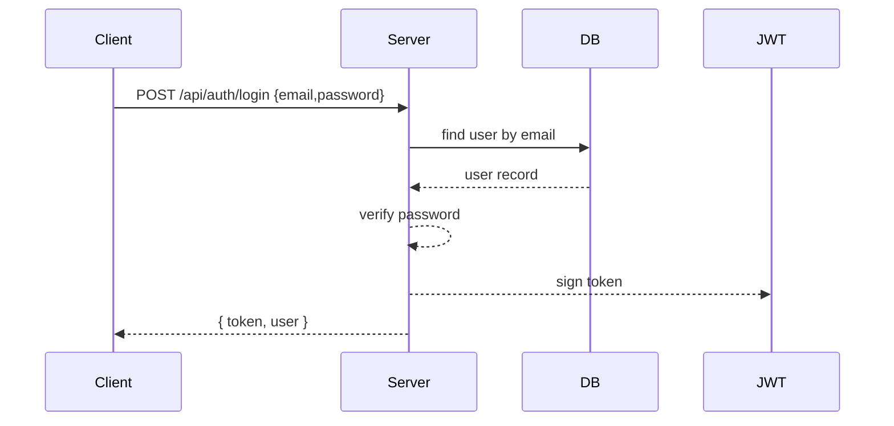
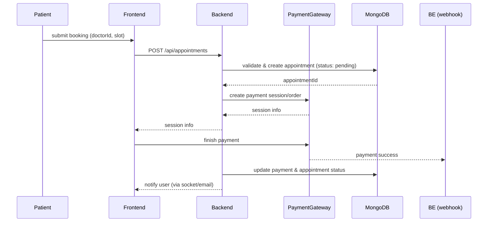

# Low-Level Design (LLD) — HEALTHCARE_APPOINTMENT_SYSTEM

Last updated: 2025-08-20

This document describes the low-level design for the Healthcare Appointment Platform (MERN). It complements the high-level design and maps directly to the repository structure (`backend/`, `frontend/`). It is intended for engineers and reviewers.

## Contents
- Overview
- Components & Responsibilities
- Data models (Mongoose-style)
- REST API contract (summary)
- Sequence diagrams (mermaid)
- Middleware & cross-cutting concerns
- Concurrency & data integrity
- File upload & media lifecycle
- Payments & webhooks
- AI (OCR + Gemini) pipeline
- Deployment, CI/CD & environment
- Observability, testing and runbook
- Appendix: file references

## 1. Overview
The platform enables patients to find doctors, book appointments, pay online (Stripe/Razorpay), upload prescriptions, and get AI-powered summaries. Auth is JWT-based (stateless). Images and PDFs are stored in Cloudinary. OCR uses Tesseract.js/pdfjs-dist and summarization uses Gemini API.

## 2. Components & Responsibilities
- Frontend (React + Tailwind)
  - Pages: Auth, Patient Dashboard, Doctor Dashboard, Admin Dashboard, Booking flow, Payments UI, Prescription upload.
  - State: React Context for auth & global state. Local component state for UI.

- Backend (Node.js + Express)
  - Modules: `auth`, `users`, `doctors`, `appointments`, `payments`, `media`, `ai`, `admin`.
  - Folder layout: `controllers/`, `models/`, `routes/`, `middleware/`, `config/`.

- Database: MongoDB Atlas (primary). Collections: `users`, `doctors` (optional), `appointments`, `payments`, `prescriptions`, `auditlogs`.

- Media: Multer (server-side multipart parsing) -> Cloudinary (final storage + CDN).

- Payment Gateways: Stripe and Razorpay (create session/order server-side; webhooks for finality).

- AI: OCR (`Tesseract.js` / `pdfjs-dist`) -> Summarization (Gemini API). Rate-limited and background-friendly.

## 3. Data models (Mongoose-style)
Only key fields shown. Put actual definitions in `backend/models/`.

### User
- _id: ObjectId
- name: String
- email: { type:String, unique: true, index: true }
- passwordHash: String
- role: String ("patient" | "doctor" | "admin")
- phone: String
- profileImageUrl: String
- createdAt, updatedAt

### Doctor (optional separate collection)
- userId: ObjectId ref `User`
- specialization: String
- qualifications: [String]
- clinic: { address, city, pincode }
- consultationFee: Number
- availableSlots: [ { day, startTime, endTime } ]

### Appointment
- _id, patientId (ref User), doctorId (ref User/Doctor)
- startTime: Date
- endTime: Date
- status: enum [pending, confirmed, cancelled, completed, no-show]
- paymentId: ObjectId ref Payment
- notes: String
- createdAt, updatedAt
- Indexes: { doctorId:1, startTime:1 }, { patientId:1, startTime:-1 }

### Payment
- _id, appointmentId, userId
- gateway: enum [stripe, razorpay]
- amount, currency
- status: enum [initiated, success, failed, refunded]
- gatewayPaymentId, receiptUrl, metadata
- createdAt
- Unique index on gatewayPaymentId

### Prescription
- _id, appointmentId, uploadedBy
- originalFileUrl, publicId
- extractedText, summary
- aiModelVersion, status
- createdAt

## 4. REST API contract (summary)
Security: `Authorization: Bearer <token>` for protected endpoints.

Auth
- POST /api/auth/register
  - body: { name, email, password, role }
  - returns: { user, token }

- POST /api/auth/login
  - body: { email, password }
  - returns: { user, token }

Users
- GET /api/users/me
  - returns user profile
- PUT /api/users/me
  - body: multipart/form-data for profile update + image

Doctors
- GET /api/doctors?specialization=&page=&limit=
- GET /api/doctors/:id

Appointments
- POST /api/appointments
  - body: { doctorId, startTime, reason, paymentRequired }
  - validates slot, creates appointment (status: pending)
- GET /api/appointments?role=doctor|patient&page=&limit=
- GET /api/appointments/:id
- PUT /api/appointments/:id (reschedule/cancel)
- PATCH /api/appointments/:id/status (doctor/admin)

Payments
- POST /api/payments/create-session
  - body: { appointmentId, amount, gateway }
  - returns gateway session info (stripe sessionUrl or razorpay order)
- POST /api/payments/webhook/stripe
- POST /api/payments/webhook/razorpay

Media / Prescriptions
- POST /api/media/upload (multipart) → returns { url, publicId }
- POST /api/prescriptions/:appointmentId/process → triggers OCR + AI summary

Admin
- GET /api/admin/stats → protected to role=admin

Error model: `{ status, message, details? }` with standard HTTP codes.

## 5. Sequence diagrams (mermaid)

### Login / Token issuance

### Booking + Payment (overview)

## 6. Middleware & cross-cutting concerns
- `authMiddleware` — verify JWT, attach `req.user`.
- `roleMiddleware(roles[])` — route-level role checks.
- `validate(schema)` — request validation (Joi or Zod).
- `multerMiddleware` — file size/type validation.
- `errorHandler` — central error formatting & logging.
- `rateLimiter` — global and per-route limits (AI endpoints stricter).
- `requestId` — attach a request ID for tracing.

## 7. Concurrency & data integrity
- Prevent double-booking using one of:
  - DB-level unique constraint on `{doctorId, startTime}` (if slot granularity allows)
  - Transactional checks (MongoDB transactions on replica set)
  - Locking/optimistic concurrency with version field

- Use idempotency keys for payment/session creation.

## 8. File upload & media lifecycle
- Validate file type and size in Multer middleware.
- Stream/upload file from server to Cloudinary. Delete temp file after upload.
- Save `{url, publicId, mimeType, size, uploadedBy}` to DB.

Limits: images <= 5MB, PDFs <= 20MB (adjustable).

## 9. Payments & webhooks
- Create `Payment` doc with status `initiated` before creating external session.
- Store idempotency key: `userId:appointmentId:gateway`.
- Webhook handlers must verify provider signature.
- Update `Payment` and `Appointment` on webhook success/failure.
- Notify users; record events in `AuditLog`.

## 10. AI & OCR pipeline
- Steps: fetch file -> extract text (pdfjs/tesseract) -> sanitize/normalize -> chunk for model if large -> call Gemini API for summary -> store extracted text + summary.
- Run heavy work in background queue (Bull/BullMQ + Redis) to avoid blocking server.
- Rate-limit calls and persist `aiModelVersion` + `cost` metadata.

## 11. Deployment & CI/CD
- Frontend: Vercel (or Netlify) — build + CDN.
- Backend: Heroku / AWS ECS / GCP Cloud Run — containerized or Node process behind load balancer.
- DB: MongoDB Atlas.
- CI: GitHub Actions — lint, tests, build, deploy.

## 12. Observability & testing
- Logging: `winston`/`pino` (structured JSON), include `requestId` and user context.
- Error tracking: Sentry.
- Metrics: Prometheus-friendly metrics for request latency & error rate.

Testing
- Unit: Jest for utilities/controllers
- Integration: supertest for endpoints
- E2E: booking -> payment -> webhook flow in staging

## 13. Runbook (key ops)
- Payment webhook failing: verify signature, re-deliver webhook, check idempotency.
- Double-booking: reconcile using admin endpoints; refund if payment processed.
- AI errors: retry with backoff; mark `Prescription` status `failed` for manual review.

## 14. Env vars (core list)
- `MONGO_URI`, `JWT_SECRET`, `JWT_EXPIRY`
- `STRIPE_SECRET`, `STRIPE_WEBHOOK_SECRET`
- `RAZORPAY_KEY`, `RAZORPAY_SECRET`
- `CLOUDINARY_CLOUD_NAME`, `CLOUDINARY_API_KEY`, `CLOUDINARY_API_SECRET`
- `GEMINI_API_KEY`
- `SMTP_HOST`, `SMTP_USER`, `SMTP_PASS`
- `REDIS_URL` (optional)

## 15. Appendix — repo file references
- Backend entry: `backend/server.js`
- Models: `backend/models/*.js`
- Controllers: `backend/controllers/*Controller.js`
- Multer: `backend/middleware/multer.js`
- Auth middleware: `backend/middleware/authUser.js`, `authDoctor.js`, `authAdmin.js`
- Payment routes: `backend/routes/*` and `backend/controllers/*`
- Frontend: `frontend/src/` and `admin/src/`

---

If you'd like, I can now:
- export this Markdown to PDF and attach it, or
- add Mermaid rendered PNGs for the diagrams, or
- generate a full OpenAPI YAML (I have added a basic spec) and provide a Swagger UI. 

Which of these next? (I can generate the OpenAPI spec now.)
